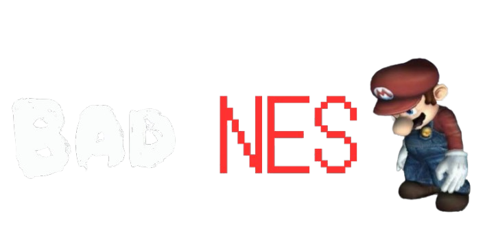

# BAD-NES

<p align="center">
  
</p>

<p align="center">
  <b>The intentionally bad NES emulator.</b><br>
  Made with Claude AI. Probably should have been tested first.
</p>

---

## 🎮 What is BAD-NES?

**BAD-NES** is an intentionally bad NES emulator made with help from **Claude AI**.

It's not designed to be the most accurate NES emulator ever made.

It's designed to be **BAD**.

> ⚠️ Expect bugs, weird behavior, questionable decisions, and things that probably shouldn't happen.

---


No installation required.

---

## 📥 Downloads

| Version                | Description                |
| ---------------------- | -------------------------- |
| 🌐 **HTML**            | Standalone browser version |
| 📱 **Android**         | Android APK                |
| 🖥️ **Windows 32-bit** | Win32 version              |
| 🖥️ **Windows 64-bit** | Win64 version              |

Download the available versions from the BAD-NES website.

---

## 🕹️ Features

* NES ROM loading
* Browser-based emulator
* Keyboard controls
* Touch controls
* Emulator settings
* Standalone HTML version
* Multiple planned platforms
* AI-assisted development
* Probably some bugs 🗿

---

## 💻 Running BAD-NES

### HTML Version

1. Download `BAD-NES.html`
2. Open it in a modern web browser
3. Load a compatible NES ROM
4. Play

That's it.

No installer.

No 47-step setup guide.

Just **BAD-NES.html**.

---

## 📁 Repository Structure

```text
BAD-NES/
│
├── index.html
├── BAD-NES.html
├── logo.png
├── background.png
└── README.md
```

### Files

**`index.html`**
The BAD-NES website and online emulator page.


## 🤖 Made With Claude AI

BAD-NES was developed with help from **Claude AI**.

The project is also an experiment in AI-assisted programming and emulator development.

The goal wasn't perfection.

The goal was to make an emulator that is proudly...

# BAD.

---

## 🐛 Known Problems

BAD-NES may have:

* Emulation bugs
* Compatibility issues
* Performance problems
* Games that don't work properly
* Weird graphics
* Weird audio
* Features that behave strangely
* Other completely unexpected nonsense

If something breaks:

**Congratulations. You found another BAD-NES feature.** 💀

---

## 📜 Disclaimer

BAD-NES is an unofficial emulator project.

NES is a trademark of Nintendo. BAD-NES is not affiliated with or endorsed by Nintendo.

You are responsible for obtaining and using ROM files legally.

---

## 🔗 Links

**Website:**
`retroweb123.neocities.org`

## 📜 BAD-NES History

**BAD-NES v1.0**

> The beginning of something that probably shouldn't have been made.

More versions coming eventually.

---

<p align="center">
  
  <br><br>
  <i>The NES emulator that probably should have been tested first.</i>
</p>
